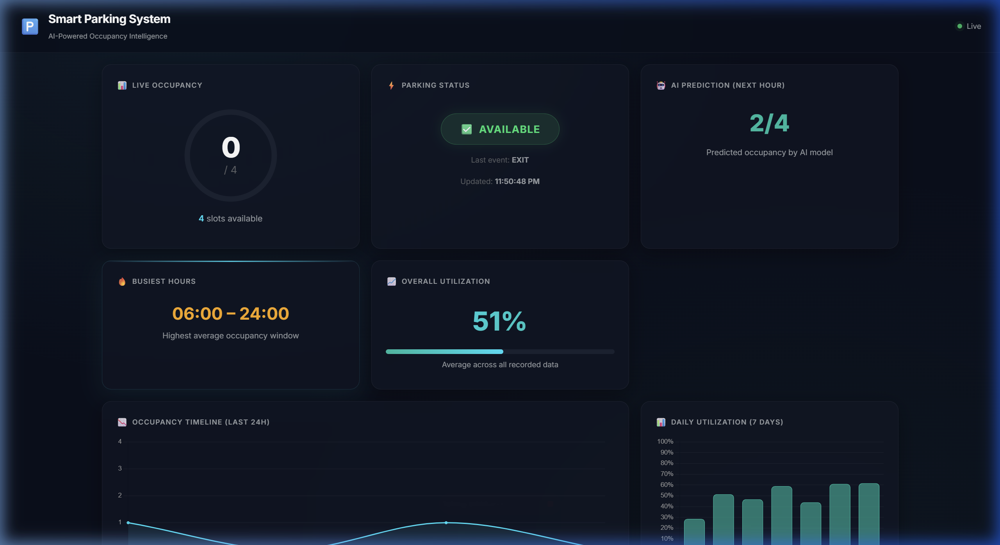
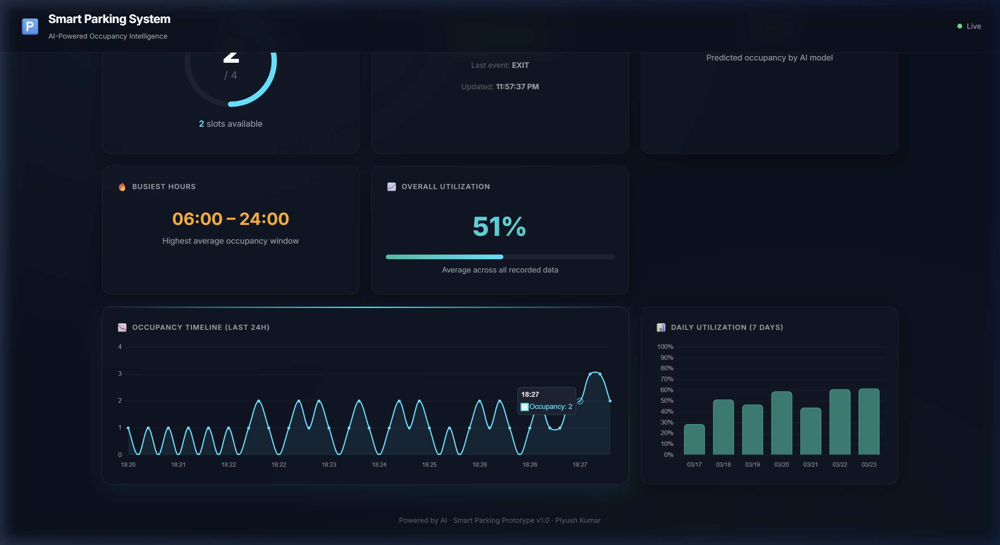
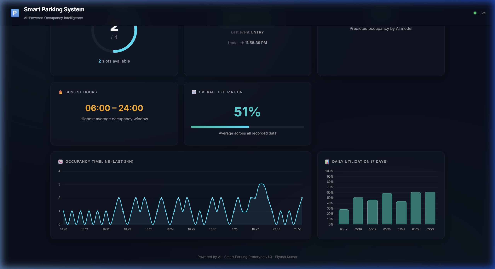

# Document 07 — Frontend Dashboard Documentation

---

## 7.1 Dashboard Overview

The frontend is a single-page web dashboard that displays live parking data through 7 interactive cards. It connects to the Flask backend via both REST API (initial load) and WebSocket (real-time updates).

### Dashboard Screenshot — Initial Load



### Dashboard Screenshot — Live Events Flowing



### Dashboard Screenshot — Final State After Extended Run



## 7.2 Design System

### Color Palette

| Token | Hex Code | Usage |
|---|---|---|
| `--bg-primary` | `#0a0f1c` | Body background — deep dark navy |
| `--bg-secondary` | `#111827` | Card fallback background |
| `--bg-tertiary` | `#1a2332` | Ring background, chart grid |
| `--bg-card` | `rgba(17, 24, 39, 0.65)` | Glass card background (translucent) |
| `--accent-cyan` | `#00e5ff` | Primary accent — occupancy ring, chart line |
| `--accent-teal` | `#00bfa5` | Secondary accent — daily chart bars, utilization gradient |
| `--accent-green` | `#00e676` | Positive status — "Available" badge, live dot |
| `--accent-red` | `#ff1744` | Negative status — "FULL" badge, disconnected dot |
| `--accent-amber` | `#ffab00` | Warning — peak hours display, near-full ring |
| `--accent-blue` | `#448aff` | Reserved — links, secondary elements |
| `--text-primary` | `#e8eaed` | Body text |
| `--text-secondary` | `#9aa0a6` | Labels, descriptions |
| `--text-heading` | `#ffffff` | Headings, occupancy count |
| `--text-muted` | `#5f6368` | Timestamps, footer |

### Typography

| Element | Font | Weight | Size |
|---|---|---|---|
| Body text | Inter | 400 (Regular) | 16px (1rem) |
| Card labels | Inter | 600 (SemiBold) | 12px (0.75rem), UPPERCASE |
| Occupancy count | Inter | 800 (ExtraBold) | 48px (3rem) |
| Status badge | Inter | 700 (Bold) | 17.6px (1.1rem), UPPERCASE |
| Prediction value | Inter | 800 (ExtraBold) | 40px (2.5rem) |
| Peak time | Inter | 700 (Bold) | 28.8px (1.8rem) |
| Utilization value | Inter | 800 (ExtraBold) | 44.8px (2.8rem), gradient fill |

### Glassmorphism Effect

Each card uses a glassmorphism design pattern:
```css
background: rgba(17, 24, 39, 0.65);    /* Translucent */
border: 1px solid rgba(255, 255, 255, 0.06);  /* Subtle border */
backdrop-filter: blur(16px);            /* Background blur */
box-shadow: 0 8px 32px rgba(0, 0, 0, 0.3);  /* Depth shadow */
border-radius: 1rem;                    /* Rounded corners */
```

### Animations

| Animation | Target | Behavior |
|---|---|---|
| `fadeIn` | All cards | Staggered entrance — cards fade in sequentially (50ms delay each) |
| `pulse-live` | Live indicator dot | Continuous green glow pulse when connected |
| `pulse-badge` | "FULL" badge | Red glow pulsation when parking is at capacity |
| Hover lift | All cards | `translateY(-3px)` with cyan border highlight on hover |
| Top-line reveal | All cards | Cyan gradient line at top edge appears on hover |
| Ring animation | Occupancy ring | `stroke-dashoffset` transition (0.8s ease) when count changes |
| Utilization bar | Utilization fill | Width transition (0.6s ease) when percentage changes |

### Responsive Breakpoints

| Screen Width | Grid Layout | Notes |
|---|---|---|
| > 1024px | 3 columns | Full desktop layout |
| 641px - 1024px | 2 columns | Tablet layout |
| ≤ 640px | 1 column | Mobile layout, header padding reduced |

## 7.3 Dashboard Cards (7 Total)

### Card 1: Live Occupancy Ring

| Property | Value |
|---|---|
| **Element ID** | `card-occupancy` |
| **Data source** | `/api/status` (initial) + WebSocket `parking_update` (live) |
| **Visual** | SVG circle with animated stroke-dashoffset |
| **Center display** | Large count number (e.g., "2") / max capacity (e.g., "/ 4") |
| **Below ring** | "X slots available" with cyan-highlighted number |

**Color logic:**
| Count | Ring Color |
|---|---|
| 0 to max-2 | Cyan (`#00e5ff`) |
| max-1 | Amber (`#ffab00`) — warning class |
| max (full) | Red (`#ff1744`) — full class |

**SVG Math:**
- Circle radius: 65
- Circumference: 2 × π × 65 ≈ 408.41
- Offset formula: `circumference × (1 - count/max)` — 0 = fully filled ring

---

### Card 2: Status Badge

| Property | Value |
|---|---|
| **Element ID** | `card-status` |
| **States** | Available (green badge) / FULL (red pulsing badge) |
| **Additional info** | Last event type (ENTRY/EXIT) + timestamp |

**Badge transitions:** Smooth CSS class swap between `badge-ok` and `badge-full` with 0.4s transition. FULL state includes continuous `pulse-badge` animation creating red glow effect.

---

### Card 3: AI Prediction (Next Hour)

| Property | Value |
|---|---|
| **Element ID** | `card-prediction` |
| **Data source** | `/api/predictions` (initial load + every 5 minutes) |
| **Display** | Large teal number "2/4" format |
| **Subtitle** | "Predicted occupancy by AI model" |

---

### Card 4: Busiest Hours

| Property | Value |
|---|---|
| **Element ID** | `card-peak` |
| **Data source** | `/api/predictions` (part of prediction response) |
| **Display** | Amber colored time range "06:00 – 24:00" |
| **Subtitle** | "Highest average occupancy window" |

---

### Card 5: Overall Utilization

| Property | Value |
|---|---|
| **Element ID** | `card-utilization` |
| **Data source** | `/api/predictions` (utilization_avg field) |
| **Display** | Large gradient text "51%" (cyan → teal gradient fill) |
| **Progress bar** | Horizontal bar with gradient fill matching the percentage |
| **Subtitle** | "Average across all recorded data" |

---

### Card 6: Occupancy Timeline (span 2 columns)

| Property | Value |
|---|---|
| **Element ID** | `card-timeline` |
| **Chart type** | Line chart (Chart.js) |
| **Data source** | `/api/history?hours=24` (initial) + WebSocket (live point injection) |
| **X-axis** | Time labels (HH:MM format) |
| **Y-axis** | Occupancy count (0 to 4, step 1) |
| **Line color** | Cyan (`#00e5ff`) |
| **Fill** | Translucent cyan (`rgba(0, 229, 255, 0.08)`) |
| **Line tension** | 0.35 (smooth curves) |
| **Max points** | 80 (oldest points are shifted off) |
| **Live update** | `chart.update('none')` — skip animation for performance |

---

### Card 7: Daily Utilization (7 Days)

| Property | Value |
|---|---|
| **Element ID** | `card-daily` |
| **Chart type** | Bar chart (Chart.js) |
| **Data source** | `/api/analytics/daily?days=7` |
| **X-axis** | Date labels (MM/DD format) |
| **Y-axis** | Utilization percentage (0% to 100%) |
| **Bar color** | Teal (`rgba(0, 191, 165, 0.6)` fill, `#00bfa5` border) |
| **Bar radius** | 6px rounded corners |

## 7.4 WebSocket Client

### Connection
```javascript
socket = io(window.location.origin, {
    reconnection: true,
    reconnectionDelay: 1000,
    reconnectionAttempts: Infinity
});
```

### Events Handled

| Event | Handler | Action |
|---|---|---|
| `connect` | Adds `connected` class to live dot | Shows green indicator, text "Live" |
| `disconnect` | Removes `connected` class | Shows red dot, text "Disconnected" |
| `connect_error` | Updates text | Shows "Reconnecting..." |
| `parking_update` | `updateDashboard(data)` + `addChartDataPoint(data)` | Updates all cards + injects chart point |

### Auto-Reconnection
The client automatically reconnects with a 1-second delay, retrying indefinitely. This ensures the dashboard survives temporary server restarts or network interruptions.

## 7.5 Data Loading Sequence

```
DOMContentLoaded
    │
    ├── loadInitialData()
    │   ├── fetch('/api/status')     → updateDashboard()
    │   └── fetch('/api/predictions') → updatePrediction()
    │
    ├── initCharts()
    │   ├── fetch('/api/history?hours=24') → initTimelineChart()
    │   └── fetch('/api/analytics/daily?days=7') → initDailyChart()
    │
    ├── initWebSocket()
    │   └── io(origin) → connect → listen for 'parking_update'
    │
    └── setInterval(refreshPredictions, 5 minutes)
```

## 7.6 PWA Configuration

```json
{
    "name": "Smart Parking System",
    "short_name": "SmartPark",
    "display": "standalone",
    "background_color": "#0a0f1c",
    "theme_color": "#0a0f1c"
}
```

The manifest enables the dashboard to be installed as a standalone app on mobile devices, with the dark background seamlessly matching the status bar.

---

*Document Version: 1.0 | Date: 2026-03-26 | Author: Piyush Kumar*
